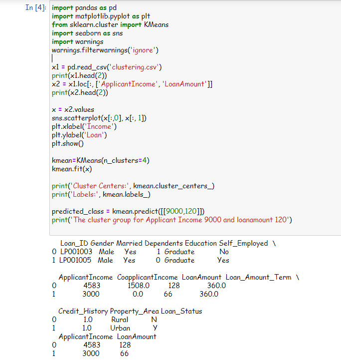
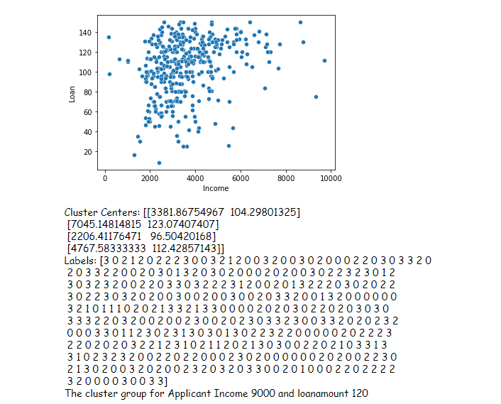

# Implementation of K-Means Clustering Algorithm
## Aim
To write a python program to implement K-Means Clustering Algorithm.
## Equipment’s required:
1.	Hardware – PCs
2.	Anaconda – Python 3.7 Installation

## Algorithm:

### Step1
<br> Import pandas ,matplotlib and import clusters from sklearn .

### Step2
<br>Import warnings and import seaborn

### Step3
<br>read the csv file with panda.Then mention the head and tail region.

### Step4
<br>plot the x value as income of applicant and then y value as loan of applicant.

### Step5
<br>Insert k-means(clusters) and fit to predict the required values.

## Program:
```
import pandas as pd
import matplotlib.pyplot as plt
from sklearn.cluster import KMeans
import seaborn as sns
import warnings
warnings.filterwarnings('ignore')

x1 = pd.read_csv('clustering.csv')
print(x1.head(2))
x2 = x1.loc[:, ['ApplicantIncome', 'LoanAmount']]
print(x2.head(2))

x = x2.values
sns.scatterplot(x[:,0], x[:, 1])
plt.xlabel('Income')
plt.ylabel('Loan')
plt.show()

kmean=KMeans(n_clusters=4)
kmean.fit(x)

print('Cluster Centers:', kmean.cluster_centers_)
print('Labels:', kmean.labels_)

predicted_class = kmean.predict([[9000,120]])
print('The cluster group for Applicant Income 9000 and loanamount 120')


```
## Output:

### Insert your output



## Result
Thus the K-means clustering algorithm is implemented and predicted the cluster class using python program.